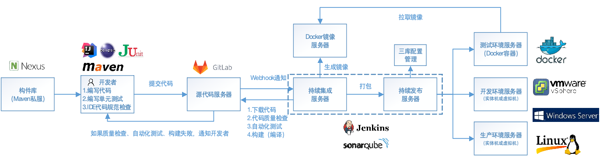
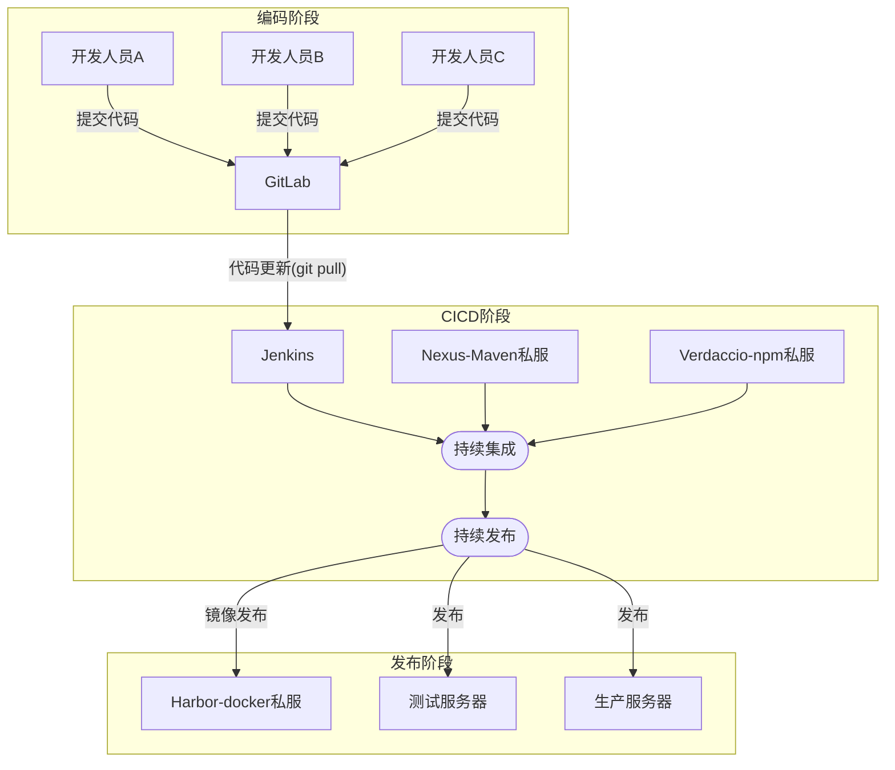

# 开源 DevOps 研发流程体系实践

## 1 DevOps 介绍

```mermaid
  graph TB
    subgraph 编码阶段
        开发人员A -->|提交代码| GitLab
        开发人员B -->|提交代码| GitLab
        开发人员C -->|提交代码| GitLab
    end

    GitLab --代码更新(git pull)--> Jenkins

    subgraph "CICD阶段"
        Jenkins --> C([持续集成])
        C --> B([持续发布])

        Nexus-Maven私服 --> C
        Verdaccio-npm私服 --> C
    end

    subgraph "发布阶段"
        B -->|镜像发布| Harbor-docker私服
        B --发布--> 测试服务器
        B --发布--> 生产服务器
    end
```
